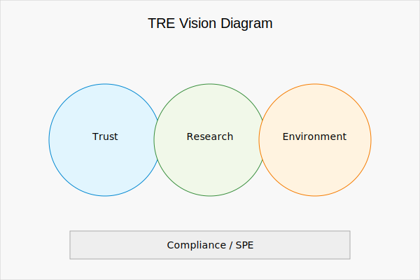

# Overview

Harvard’s Trusted Research Environment (TRE) is a controlled platform for analysis of sensitive data.
It combines workflow provenance, secure infrastructure, and reproducible research practices.
The environment aligns with the Five Safes model and with the European concept of Secure Processing Environments for secondary use of health data.

**What the TRE provides**
- Controlled access to data through authenticated, role-based entry.
- Reproducible analysis by recording code, parameters, environments, and outputs.
- Collaboration using standard tools (e.g., RStudio, Jupyter, SAS, MATLAB) within a secured boundary.
- Output checking prior to release to protect confidentiality and comply with policy.
- Deployment patterns for pilots, institutional services, and federated collaboration.

**Process, at a glance**
1. Project onboarding and role assignment.
2. Workspace provision with curated datasets.
3. Workflow execution with automatic provenance capture.
4. Output review and disclosure control.
5. Publication or approved export.

??? info "Technical detail"
    - Workflow descriptions (e.g., CWL/Nextflow) and W3C PROV lineage support verification and re-run.
    - Versioning of datasets, code, containers, and configurations.
    - Encryption in transit and at rest; multi-factor authentication; role-based access control.
    - Comprehensive logging and monitoring.

**Next**
- See **Trust** for provenance and compliance.
- See **Research** for tools and lifecycle.
- See **Deployment Blueprint** for implementation options.
- See **Project Overview** for an example in use.
