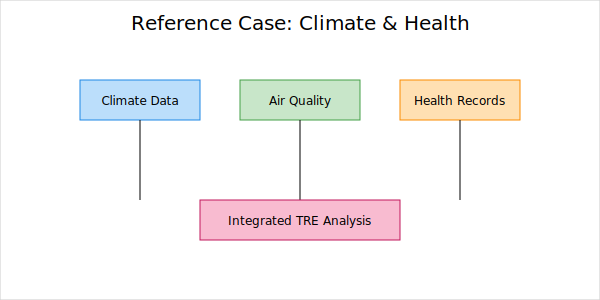

# Project Overview

This case study illustrates TRE use for climate and health integration.

**Context**
- Integration of climate, air quality, demographics, and claims data.
- Multi-stage workflow; each step logged as lineage.
- Outputs reviewed before release.

**Why it is representative**
- End-to-end transparency and reproducibility checks.
- Reduced manual effort for compliance documentation.
- Collaboration without raw data export.

??? info "Workflow sketch"
    Raw sources → ingest and quality checks → harmonisation → analysis and validation → output review → publication.
