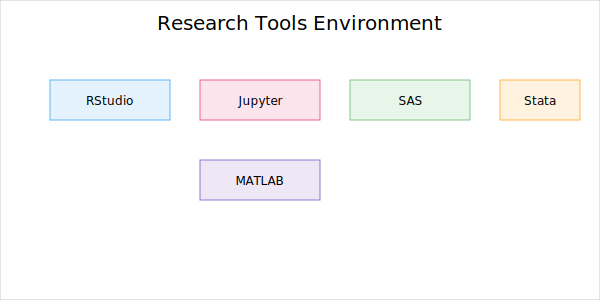
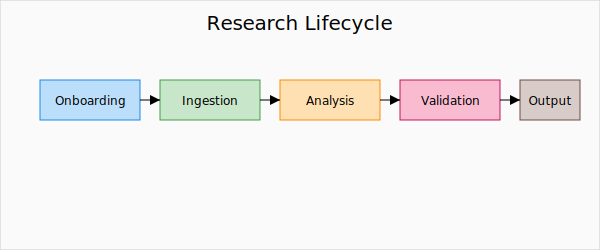

# Research

Researchers use familiar tools within the TRE.
The environment provides a secured workspace and a workflow lifecycle that records methods and results for verification.

**Research tools (examples)**
- Interactive tools: RStudio, Jupyter.
- Statistical packages: SAS, Stata, MATLAB.
- Terminal and batch execution for pipelines.
- Single sign-on and session management.

**Lifecycle tasks**
- Project registration and eligibility checks.
- Data ingestion and curation with quality controls.
- Workflow execution with automatic provenance capture.
- Reproducibility and validation.
- Output review and publication or approved export.

??? info "Under the hood"
    - Workflow orchestration integrates with provenance capture.
    - Parameterized pipelines enable consistent, re-runnable analysis.
    - Result artifacts include metadata for discovery and audit.
