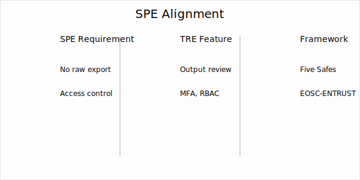

# Trust

This page describes data provenance and compliance, including alignment with Secure Processing Environments.

## Data Provenance
Data provenance is necessary for reproducibility and audit.
Harvard TRE implements automatic provenance capture using workflow-based processing and standards-aligned lineage.

**Core mechanisms**
- Workflow-first processing (Common Workflow Language, Nextflow).
- W3C PROV lineage graphs linking inputs, parameters, containers, and outputs.
- Versioning of datasets, code, and computational environments.
- Catalog entries for artifacts to enable re-run and verification.

**Benefits**
- Researchers: reproducible results without additional manual logging.
- Reviewers: trace from raw data to published output.
- Stewards: visibility into data quality and downstream dependencies.

??? info "Technical detail"
    - Container-based execution (Docker/OCI) to ensure consistent environments.
    - Version control for workflow definitions and configurations.
    - Runtime metadata: parameters, software versions, resource usage.
    - Validation frameworks for re-execution and cross-checking.

## Compliance (including SPE and trust frameworks)
Secure Processing Environments are required in Europe for secondary use of health data.
The TRE design supports these requirements and the Five Safes model.

**Selected requirements and TRE features**
- No raw data export → controlled output review and disclosure control.
- Strong access control → multi-factor authentication and role-based permissions.
- Auditability → logs and lineage capture for review.
- Jurisdictional control → deployable in-region to meet locality requirements.

**Trust frameworks and initiatives**
- Five Safes principles (People, Projects, Settings, Data, Outputs).
- EOSC-ENTRUST approaches to federated trust and assurance.
- Compatibility with DARE/HDR practices for trusted environments.

